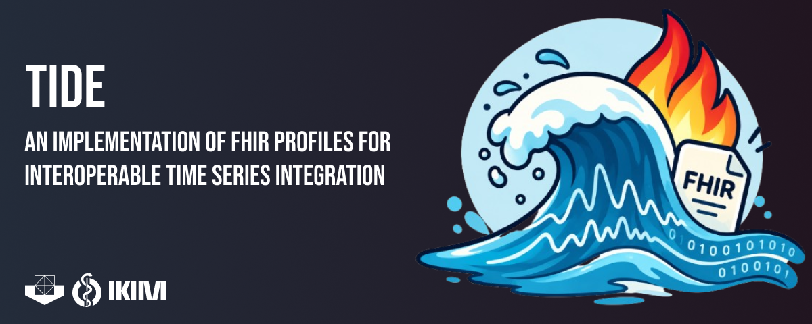

<p align="center">
  
</p>

# TIDE - Time Series Integration and Data in Endpoints

TIDE is a FHIR R4 Implementation Guide for representing continuous high-resolution
time series data (e.g., EEG, ECG, waveform monitoring) using a Metadata-Proxy
pattern: structured analytical metadata is carried in FHIR Observation resources,
while the underlying raw signal data is referenced externally through TIDEEndpoint
resources.

This repository accompanies the manuscript *"Exchange of High Frequency Medical Monitoring Data Using Fast Healthcare
Interoperability Resources for Interoperable Integration Into Clinical Practice and Research: Methodological Development Study"*
(submitted to JMIR Medical Informatics) and contains the full source needed to reproduce the FHIR profiles, the evaluation pipeline and
the implementation guide referenced there.

## Repository structure

| Path | Contents |
|---|---|
| `TIDE-IG/` | Buildable FHIR Implementation Guide (SUSHI project: `sushi-config.yaml`, `input/fsh/`, `input/pagecontent/`) — sole source for all profiles, extensions, and terminology |
| `TIDE-IG/input/examples/` | Example instances (Patient, Device, Endpoint, Observation) extracted from the evaluation bundle, validated by the IG Publisher |
| `scripts/` | Evaluation pipeline: EDF/BIDS ingestion, FHIR resource construction, precision/recall evaluation, synthetic metric validation, bundle export |
| `scripts/ac2_comparison/` | Quantitative comparison of TIDE with SampledData, DocumentReference and UV PoCD SampleArrayObservation on an isolated FHIR server |
| `tide_evaluation_bundle.html` | FHIR transaction Bundle containing all resources produced during the proof-of-concept evaluation, for direct inspection or loading into an independent FHIR R4 server |

## TIDE artifacts

| Type | Name | Canonical URL |
|---|---|---|
| Profile | TIDEObservation | `http://example.org/tide/StructureDefinition/tide-observation` |
| Profile | TIDEObservationChild | `http://example.org/tide/StructureDefinition/tide-observation-child` |
| Profile | TIDEEndpoint | `http://example.org/tide/StructureDefinition/tide-endpoint` |
| Extension | RawDataEndpoint | `http://example.org/tide/StructureDefinition/tide-rawdata-endpoint` |
| Extension | PreviewEndpoint | `http://example.org/tide/StructureDefinition/tide-preview-endpoint` |
| CodeSystem | TIDECodeSystem | `http://example.org/tide/CodeSystem/tide-code-system` |
| CodeSystem | TIDESupplementalCodes | `http://example.org/tide/CodeSystem/tide-supplemental-codes` |
| CodeSystem | TIDEChannelCodeSystem | `http://example.org/tide/CodeSystem/tide-channel-code-system` |
| CodeSystem | TIDEConnectionTypeCodes | `http://example.org/tide/CodeSystem/tide-connection-type-codes` |
| ValueSet | TIDEValueSet | `http://example.org/tide/ValueSet/tide-value-set` |
| ValueSet | TIDEChannelValueSet | `http://example.org/tide/ValueSet/tide-channel-value-set` |
| SearchParameter | tide-observation-bodysite | `http://example.org/tide/SearchParameter/tide-observation-bodysite` |

> **Note:** canonical URLs are currently placeholders (`http://example.org/tide/...`)
> and will be replaced with the final canonical namespace upon formal publication
> of the Implementation Guide.

## Building the Implementation Guide

```
cd TIDE-IG
sushi build .                                          # FSH -> FHIR JSON (fsh-generated/)
java -jar publisher.jar -ig . -no-sushi                # full HTML rendering (output/)
```

Requires [SUSHI](https://fshschool.org/docs/sushi/) and, for the full HTML rendering,
the [FHIR IG Publisher](https://confluence.hl7.org/display/FHIR/IG+Publisher+Documentation)
(Java 17+). The build validates all SNOMED CT and LOINC codes against tx.fhir.org; add
`-tx n/a` only for offline builds, in which case external codes are not checked.

## Running the evaluation pipeline

```
# 1. start Blaze (https://github.com/samply/blaze) on :8080 with the custom bodysite SearchParameter:
docker run -d -p 8080:8080 \
  -e DB_SEARCH_PARAM_BUNDLE=/app/tide-search-params.json \
  -v "$(pwd)/scripts/tide-search-params.json:/app/tide-search-params.json:ro" \
  samply/blaze:1.7.0
pip install mne numpy scipy pandas requests

# 2. place the two OpenNeuro datasets under data/ (see "Data" below), then:
python scripts/tide_pipeline.py                # flat model (ds007808)
python scripts/tide_pipeline_v2.py             # hierarchical model (ds007823)
python scripts/evaluate.py                     # precision/recall, example queries, coverage report

# 3. metric validation and bundle export
python scripts/validate_metrics_synthetic.py   # ground-truth checks of the metrics on synthetic signals
python scripts/export_bundle.py                # exports all resources as a transaction Bundle
python scripts/build_examples.py               # splits the bundle into TIDE-IG/input/examples/

# 4. optional: comparison with alternative FHIR approaches (isolated Blaze on :8081)
docker compose -f scripts/ac2_comparison/docker-compose.ac2.yml up -d
python scripts/ac2_comparison/benchmark.py
```

Outputs are written to `results/` (examples for the IG to `TIDE-IG/input/examples/`).

`scripts/tide-search-params.json` registers the `bodysite` SearchParameter
(`tide-observation-bodysite`) in Blaze. It must be configured before any data is loaded.
Without it, Blaze ignores the unknown `bodysite` parameter and the channel-level query
returns all Observations instead of the per-channel matches.

## Data

This repository does not include raw EEG data. The pipeline uses two public,
CC0-licensed BIDS-EEG datasets from OpenNeuro, which must be downloaded locally
to `data/ds007808/` and `data/ds007823/` (e.g. with the
[OpenNeuro CLI](https://docs.openneuro.org/packages/openneuro-cli.html) or
[DataLad](https://www.datalad.org/)):

| Dataset | Description | DOI |
|---|---|---|
| ds007808 | EEG-Speech Brain Decoding Dataset | [10.18112/openneuro.ds007808.v1.0.0](https://doi.org/10.18112/openneuro.ds007808.v1.0.0) |
| ds007823 | COVID-19 survivors and close contacts EEG dataset |[10.18112/openneuro.ds007823.v1.0.0](https://doi.org/10.18112/openneuro.ds007823.v1.0.0) |

The evaluation reported in the manuscript used the following five recordings
(the pipelines process every matching EDF file found under `data/`, so place only
these files there to reproduce the published bundle):

```
data/ds007808/sub-03/ses-20240821/eeg/sub-03_ses-20240821_task-speechopen_acq-pangolin_run-01_eeg.edf
data/ds007808/sub-03/ses-20240821/eeg/sub-03_ses-20240821_task-speechopen_acq-pangolin_run-02_eeg.edf
data/ds007823/sub-CUCOV003/eeg/sub-CUCOV003_task-COVID_eeg.edf
data/ds007823/sub-CUCOV008/eeg/sub-CUCOV008_task-COVID_eeg.edf
data/ds007823/sub-CUCOV020/eeg/sub-CUCOV020_task-COVID_eeg.edf
```

Each pipeline also needs the BIDS sidecar files next to each EDF file (`*_eeg.json`,
`*_channels.tsv`, `*_events.tsv`).

The resulting FHIR resources do not duplicate the raw signal files: TIDE's
`TIDEEndpoint` resources reference the original EDF files on OpenNeuro
(connection type `direct-https` from `TIDEConnectionTypeCodes`).

## Contact

Corresponding author:<br>
Dr. René Hosch<br>
University Hospital Essen<br>
Hufelandstraße 55, 45147 Essen<br>
[rene.hosch@uk-essen.de](mailto:rene.hosch@uk-essen.de)

Yutong Wen M. Sc.<br> 
University Hospital Essen<br>
Hufelandstraße 55, 45147 Essen<br>
[yutong.wen@uk-essen.de](mailto:yutong.wen@uk-essen.de)

Sara Erma Kaya M. Sc.<br> 
University Hospital Essen<br>
Hufelandstraße 55, 45147 Essen<br>
[sara.kaya@uk-essen.de](mailto:sara.kaya@uk-essen.de)
